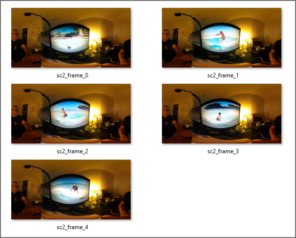
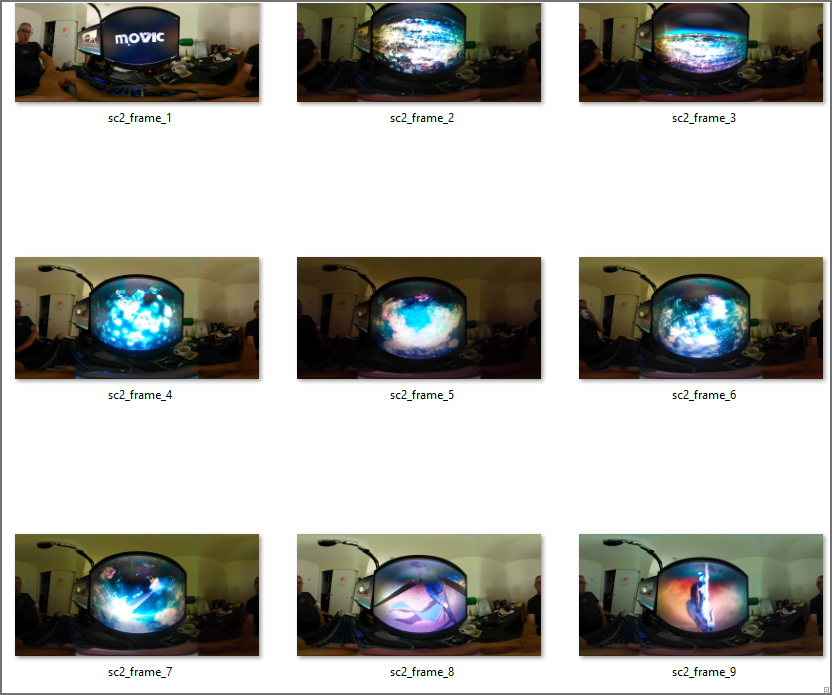
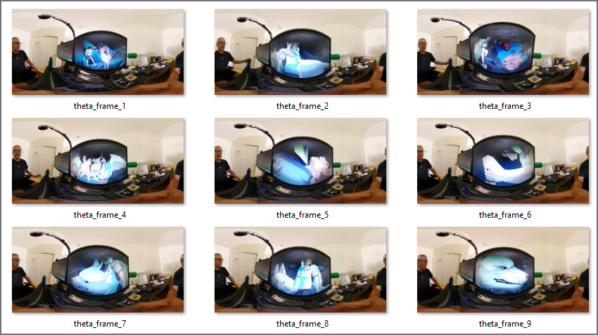
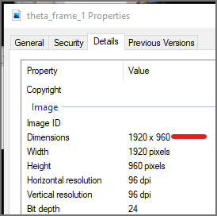

# RICOH THETA Live Preview Tester

Command line tester for RICOH THETA [get live preview API](https://api.ricoh/docs/theta-web-api-v2.1/commands/camera.get_live_preview/).


The tester can also be used to test a subset of common camera commands.

## Usage

```shell
dart .\tpreview.dart
RICOH THETA Live Preview tester

Usage: tpreview <command> [arguments]

Global options:
-h, --help    Print this usage information.

Available commands:
  checkForIdle       wait for camera to be idle after startCapture or self timer for next command
  imageMode          Switch camera to image mode
  info               camera information, including model, serial number
  intervalShoot      test interval shooting with 2 sets of 2 shots
  listFiles          list video and image files on camera
  previewFormat      Set preview format
  printFrames        print frame bytes to console for testing
  saveFrames         save frames from live preview stream
  sc2SaveFrames      THETA SC2 save frames from live preview stream
  setOption          Set single camera option
  state              camera status, battery level, API version, last file URL
  takePicture        take single still image.  Camera must be in still image mode
  takePictureReady   take single still image and show when camera is ready for next command
  videoMode          Switch camera to video mode

Run "tpreview help <command>" for more information about a command.
```

## Options for saveFrames

```shell
dart .\tpreview.dart saveFrames --help
save frames from live preview stream

Usage: tpreview saveFrames [arguments]
-h, --help      Print this usage information.
    --frames    --frames=5
    --delay     --delay=1000  : for 1000ms

Run "tpreview help" to see global options.
```

As the maximum frame rate is 30fps, the lowest delay between frames is
34 milliseconds.

## Examples

Examples below are with RICOH THETA SC2 with firmware 1.64

### saveFrames

With no options, will save 5 frames at 1 fps.

```shell
tpreview.exe sc2SaveFrames
```



#### Changing number of frames and delay between frames

Saving 10 frames with a delay of 10 seconds between frames.  10 seconds
is 10000 milliseconds.

Example shown using dart command on uncompiled application in `bin\tpreview.dart`.
Test with SC2 firmware 1.64.

```shell
\tpreview\bin> dart .\tpreview.dart saveFrames --frames=10 --delay 10000
frame 0
total bytes received 0.063492MB
...
```


In the example above, I am holding the camera up to my computer monitor
to test a moving scene.  I am playing a moving from YouTube on my
computer screen for the motion.

#### Z1 test

With firmware 2.00.1, the test results are the same.



Each frame can be viewed in a viewer such as FSP Viewer.


### Setting Resolution and fps with the API

You cannot use the WebAPI to change the resolution or framerate of the SC2.
The API for [previewFormat](https://api.ricoh/docs/theta-web-api-v2.1/options/preview_format/) only works with the V and Z1.

#### Set to 1920x960 @ 8fps

```shell
dart .\tpreview.dart previewFormat --width=1920 --framerate=8
{"name":"camera.setOptions","state":"done"}
```

Save frames and verify.



### tpreview state

```json
{
  "fingerprint": "FIG_0003",
  "state": {
    "batteryLevel": 0.8,
    "storageUri": "http://192.168.1.1/files/thetasc26c21a247d9055838792badc5",
    "_apiVersion": 2,
    "_batteryState": "charged",
    "_cameraError": [],
    "_captureStatus": "idle",
    "_capturedPictures": 0,
    "_latestFileUrl": "http://192.168.1.1/files/thetasc26c21a247d9055838792badc5/100RICOH/R0012015.JPG",
    "_recordableTime": 0,
    "_recordedTime": 0,
    "_function": "normal"
  }
}
```

### tpreview takePicture

```json
{
  "id": "68",
  "progress": {
    "completion": 0.0
  },
  "state": "inProgress"
}
```

### dart tpreview.dart info

This example shows how to run the `bin/tpreview.dart` source file instead
of the compiled binary.  The compiled binary will run faster.

```json
{
  "manufacturer": "RICOH",
  "model": "RICOH THETA SC2",
  "serialNumber": "20001005",
  "firmwareVersion": "01.64",
  "supportUrl": "https://theta360.com/en/support/",
  "gps": false,
  "gyro": true,
  "endpoints": {
    "httpPort": 80,
    "httpUpdatesPort": 80
  },
  "apiLevel": [
    2
  ],
  "api": [
    "/osc/info",
    "/osc/state",
    "/osc/checkForUpdates",
    "/osc/commands/execute",
    "/osc/commands/status"
  ],
  "uptime": 3294,
  "_wlanMacAddress": "58:38:79:2b:ad:c5",
  "_bluetoothMacAddress": "6c:21:a2:47:d9:05"
}
```

## Example Compiling for Windows

```shell
dart compile exe --output build/tpreview.exe .\bin\tpreview.dart
Info: Compiling with sound null safety
Generated: c:\users\craig\documents\development\ricoh\livepreview\tpreview\build\tpreview.exe
```

### Usage after compilation

```shell
cd .\build\
.\tpreview.exe info   
```

## frame conversion to video for testing

Combined frames into video with movie editor to test smoothness and check for
broken frames.


## SC2 example

Read about [limitations using dio  with the SC2](docs/sc2/sc2_problems.md).
The application provides an example using the Dart package [http](https://pub.dev/packages/http)
that works with the SC2.

Using http with the SC2 has a problem with the error
`Connection closed before full header was received`.

This appears to be a [known issue](https://github.com/flutter/flutter/issues/41573)
with Dart and Flutter.

The application appears to work despite the error.

## Use with mobile apps

The application uses a package 
[theta](https://github.com/codetricity/tpreview/tree/main/packages/theta) that can be used with Flutter.

### Z1 Test

Tests below are run by placing the THETA in front of my computer
monitoring that is playing a YouTube video showing rapid
motions. Sports videos make good tests as they generally contain
movement every frame.


### SC2 Test


### Instructions on using with Flutter

Steps to use with Flutter.

1. create stream controller
2. pass controller to either getLivePreview for Z1/V or sc2GetLivePreview
3. use StreamBuilder to take the stream
4. convert list of bytes to Uint8List
5. pass the bytes to `Image.memory()`
6. enable `gaplessPlayback`


### Flutter Example for Z1 / V

TODO: fill in once library interface stabilizes

### SC2 Example

__WARNING:__ SC2 library is only partially working. Do not
use in production applications. This is for testing and
demonstration only.


TODO: fill in once library interface stabilizes


## Status

* Sept 30, 2021: SC2 and Z1 now have consistent class interfaces.  SC2 overheats in extended testing.
* Sept 29, 2021: using different getLivePreview functions for SC2 and V/Z1.
* Sept 19, 2021: tested with Z1 and appears to work fine.
* Sept 18, 2021: live preview save to frames is working with SC2

