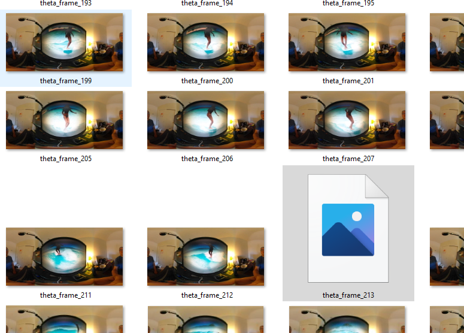
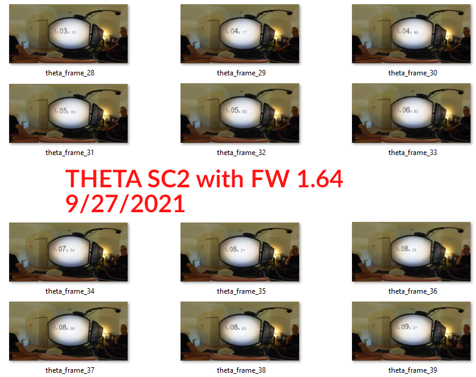

# SC2 Live Preview Problems with dio

When using Dio, I can't read SC2 frames properly at 30fps.  Some of the SC2 frames have broken images, which either creates a flickering or an "image error" for a brief moment in the displayed video.

Although I can work around this problem by using
the [http package](https://pub.dev/packages/http), this means that
the SC2 is using a different library from the Z1 and V.  As I am trying to use
the same library, I've documented the problem that I'm having with dio and the SC2
live preview.

When displayed on the Flutter screen, some of the frames are not
displaying properly.  It seems like `gaplessPlayback` can't compensate
enough.  

With the Z1, the stream is smooth.

At 5fps, 1 out of the 300 frames I tested was not readable, which is
likely a usable ratio and likely something the software can compensate for.

[Link to 1 minute test video](https://youtu.be/3P-YKr1dzQU).

* SC2 does fairly well at 250ms delay 4fps, loses about 1 frame out of 150
* at 300ms, lost 1 frame out of 300 
* at 350ms, lost 1 frame out of 300
* at 400ms, lost 1 frame out of 300

## time per frame problem

The length of time each frame takes to arrive varies.  The program
needs to wait up to a second before displaying the frame.

## Position of Camera

The position of the camera seems to matter with my equipment.

